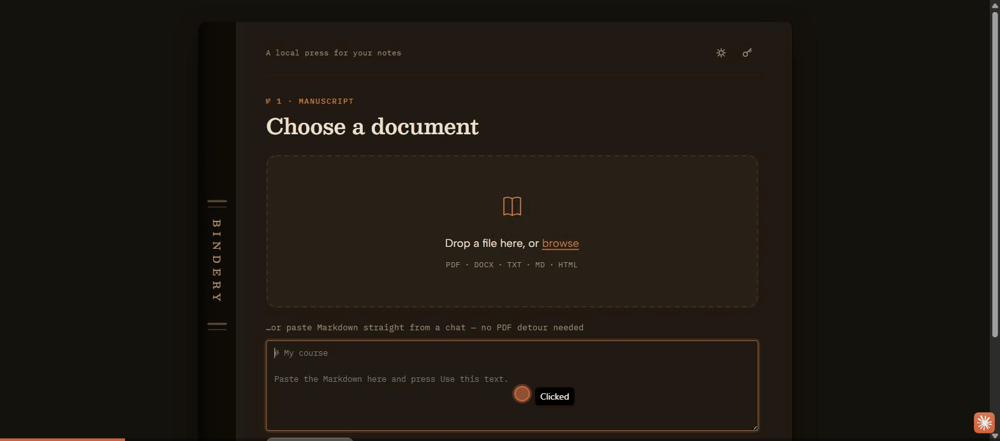

# Bindery



A local web app that turns text documents — **PDF, DOCX, TXT, Markdown, HTML** — into
clean, Kindle-friendly **EPUB3** books, and sends them straight to your Kindle. Built for
converting school notes into something pleasant to read on e-ink. Everything runs on
your machine; nothing is uploaded anywhere, except the optional AI tidy-up you trigger
yourself with your own API key.

## Features

- **Five input formats** (PDF, DOCX, TXT, Markdown, HTML) normalized into one clean
  EPUB3, with automatic OCR for scanned PDFs.
- **Optional AI tidy-up** (Anthropic / OpenAI / Google, your own key) that only fixes
  structure — never rewords — with a side-by-side review before anything is built.
- **One-click Send to Kindle** by email once it's built.
- **Local-first**: no accounts, no server-side storage, no telemetry. Your files and
  API keys never leave your machine unless you explicitly send a tidy-up request or an
  email.

## Stack

Python, FastAPI, vanilla HTML/CSS/JS (no build step). PDF via PyMuPDF, EPUB via
ebooklib, cover art via Pillow, OCR via Windows' built-in engine (`winocr`).

## Run it

```
run.bat        # Windows  (run.sh on macOS/Linux)
```

First run creates a `.venv` and installs dependencies; after that it just starts.
Then open **http://127.0.0.1:8118**. Or manually:

```
python -m venv .venv
.venv\Scripts\pip install -r requirements.txt
.venv\Scripts\python app.py
```

## How it works

```
upload / paste Markdown → extract (+OCR if scanned) → (optional AI tidy-up + review)
  → build EPUB → validate → download
```

Markdown from a chat (Claude, ChatGPT…) can be pasted straight into the upload panel —
no need to convert it to PDF first; it converts directly and comes out cleaner.

- **`backend/converters.py`** — one extractor per format. Everything is normalized into
  a shared intermediate structure (`backend/models.py`: a `Document` holding `Chapter`s
  of sanitized semantic HTML), so EPUB generation never cares about the input format.
  PDFs get de-hyphenation, paragraph re-joining across pages, and heading detection by
  font size; TXT gets heading/list heuristics.
- **`backend/epub_builder.py`** — EPUB3 via `ebooklib`, with an embedded e-ink stylesheet
  (relative font sizes, 1.5 line-height, configurable justification and paragraph style),
  a generated typographic cover (Pillow), title page, and nav/NCX table of contents.
  Every build is validated: internal structural checks always run; if you drop
  [`epubcheck.jar`](https://github.com/w3c/epubcheck/releases) into `vendor/` and have
  Java on PATH, full epubcheck runs too and its findings show up in the result screen.
- **`backend/ai_formatter.py`** — optional cleanup of messy extractions. The text is
  chunked by section and sent to Anthropic, OpenAI, or Google (direct HTTPS calls, no
  SDKs) with a prompt that only allows structural fixes — never rewording. You review
  original vs. tidied side-by-side before anything is built.
- **`app.py`** — FastAPI server; also serves the frontend (vanilla HTML/CSS/JS in
  `frontend/`, self-hosted fonts, no build step).

## API keys

Add keys in the app's Settings drawer (key icon, top right). Storage
(`backend/key_manager.py`):

- Keys are encrypted at rest with Fernet (`cryptography`).
- The **master key** lives outside the repo at `~/.bindery/master.key`.
- The **encrypted store** is `storage/.keys/keys.enc` (gitignored).
- Keys are only ever sent to their own provider's API when *you* start a tidy-up.
  They're masked to the last 4 characters in the UI and never logged. Delete a key
  any time from Settings; deleting `~/.bindery/master.key` invalidates the store.

## Getting books onto the Kindle

Set up **Send to Kindle** in the Settings drawer (your email + an app password + your
`@kindle.com` address; SMTP host defaults to Gmail) and a one-click **Send to Kindle**
button appears after every build (`backend/kindle_mail.py`, stdlib `smtplib`). Your
email must be on Amazon's [approved senders](https://www.amazon.com/sendtokindle/email)
list. The SMTP password is stored in the same encrypted store as the API keys.

Or do it by hand: email the `.epub` to your Send-to-Kindle address, use the Send to
Kindle app, or copy it over USB.

## Notes

- Generated books accumulate in `storage/output/` — delete freely.
- Scanned (image-only) PDF pages are OCR'd automatically with the OCR engine built into
  Windows 10/11 (`backend/ocr.py`, via `winocr` — no Tesseract needed). The document's
  language must be installed in Windows (Settings → Time & Language); it tries Spanish,
  then English.
- `python test_pipeline.py` runs an end-to-end self-check of all five converters and
  the EPUB builder.

## Status

Personal project, built for my own use converting study material for e-ink reading.
Works well for its intended formats; not battle-tested against every possible malformed
PDF or DOCX out there.

## License

[MIT](LICENSE) — use it however you like, just keep the attribution.
